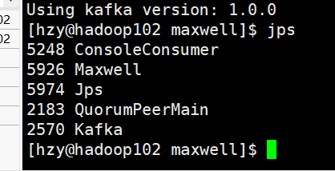

---
title: 毕业设计环境启动配置
date: 2024-03-11
----

//启动zookeeper
```
zk.sh start
```
//启动kafka
```
kf.sh start
```
//启动消费者
```
kf.sh kc ODS_BASE_LOG_1018（主题）
```
//生成数据
```
lg.sh
```
//启动maxwell
```
bin/maxwell --config config.properties --daemon
```

//启动ES
```
es.sh start
# 启动kibana
bin/kibana
```

jps查看进程启动情况
